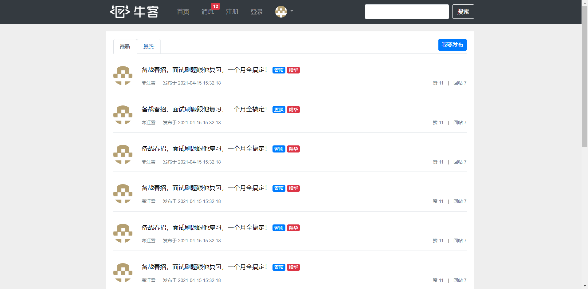
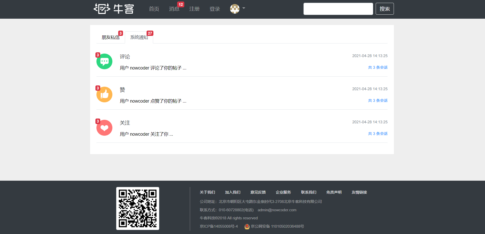
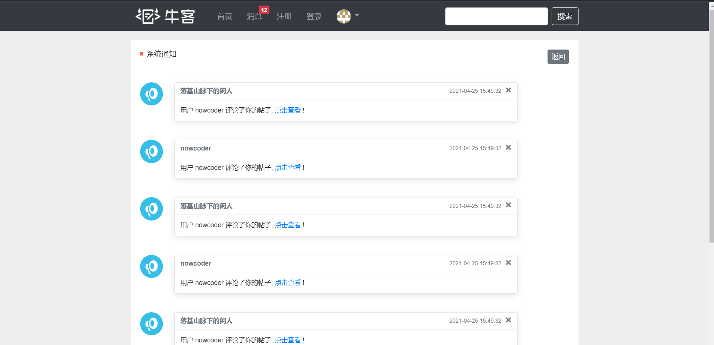
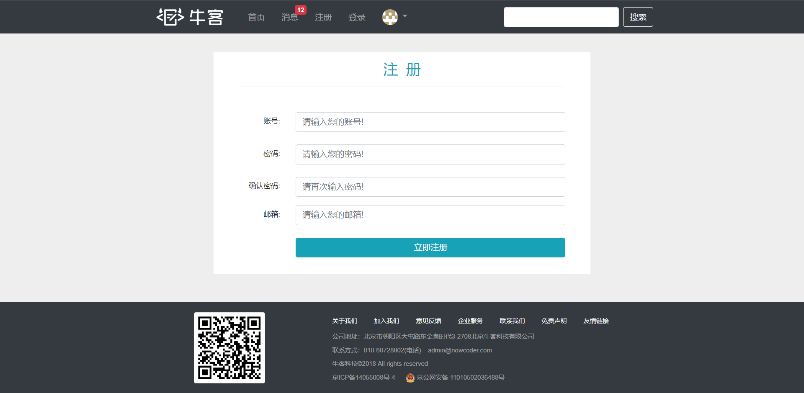

​	  

​	

## 项目简介

仿牛客网的论坛，实现了论坛的注册、登录、发帖、评论、回复、私信等功能，使用前缀树实现敏感词过滤；使用 Spring Security 做权限控制；使用Quartz定时更新热门帖子；使用 Redis 实现点赞、关注与发帖限流；使用 Kafka 处理发送评论、点赞和关注等系统通知；使用 Elasticsearch 实现全文搜索。

## 前端

## 后端

后端学习参照牛客网官方课程：https://www.nowcoder.com/study/live/246/intro
